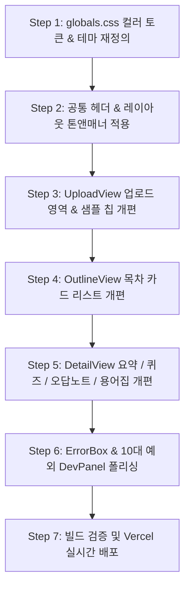

# [디자인 시스템 톤앤매너 개편 계획서] Academic Intelligence System

> **기준 문서:** `desgin.md` (Academic Intelligence System / Scholarly Ambient)  
> **목표:** 학술 연구 및 집중 학습 도구로서의 신뢰감(Trustworthy), 쾌적함(Breathable), 구조적 명확성(Structured)을 제공하는 톤앤매너 전면 개편  
> **작성일:** 2026-08-27  

---

## 1. 비주얼 컨셉 및 디자인 방향성 (Scholarly Ambient)

| 컨셉 키워드 | 세부 적용 방안 |
|---|---|
| **Trustworthy (신뢰감)** | 브랜드 핵심 컬러인 `#1f108e` (Academic Indigo)를 적용하여 정통 학술 도구로서의 전문성 부여 |
| **Breathable (쾌적성)** | 눈의 피로도를 낮추는 `#fcf8ff` (Soft Lavender White) 배경색과 여유 있는 여백(`py-10~16`, `gap-6`) 적용 |
| **Structured (구조화)** | `8px` 모서리(ROUND_EIGHT) 카드와 `#dcd8e3` (Muted Slate) 얇은 보더를 통한 명확한 정보 위계 |

---

## 2. 컬러 토큰 매핑 체계 (Color Palette)

| 토큰명 | 라이트 모드 (Light) | 다크 모드 (Dark) | 주요 용도 |
|---|---|---|---|
| **Primary** | `#1f108e` (Academic Indigo) | `#9d93ff` (Soft Luminous Indigo) | 메인 액션 버튼, 강조 텍스트, 활성 탭/배지 |
| **Primary Foreground** | `#ffffff` (Pure White) | `#0d0b1a` (Dark Slate) | Primary 버튼 내 텍스트 |
| **Surface (Background)** | `#fcf8ff` (Soft Lavender White) | `#0e0c1a` (Deep Midnight Indigo) | 전체 페이지 배경 |
| **Container (Card)** | `#ffffff` (Pure White) | `#17142b` (Deep Indigo Container) | 목차 카드, 퀴즈 카드, 용어집 카드 |
| **Outline (Border)** | `#dcd8e3` (Muted Slate) | `#2b254d` (Muted Indigo Border) | 카드 테두리, 구분선 |
| **Muted** | `#f3effa` (Pale Lavender) | `#221d3b` (Dark Lavender Muted) | 비활성 탭, 보조 칩, 코드 블록 배경 |
| **Foreground (Text)** | `#1c1833` (Deep Indigo Charcoal) | `#f5f2fc` (Crisp Off-White) | 본문 및 제목 기본 텍스트 |

---

## 3. 타이포그래피 & 인터랙션 가이드

- **Font Family**: `Inter`, `Pretendard`, system-ui
- **타이포그래피 스케일**:
  - **Display (32px+ Bold)**: 페이지 메인 타이틀 ("강의자료에서 핵심만 빠르게 찾아보세요")
  - **Headline (20~24px Semi-Bold)**: 챕터 제목, 섹션 타이틀
  - **Body (15~16px Regular, Line-height 1.6~1.7)**: 요약 불릿, 퀴즈 문제 및 해설, 용어집 설명
  - **Label (13~14px Medium)**: 버튼, 난이도 칩, 배지, 메타데이터
- **컴포넌트 둥근 모서리 (Corner Radius)**:
  - 카드 및 컨테이너: `rounded-lg` (8px / `ROUND_EIGHT`)
  - 버튼 및 칩: `rounded-lg` (8px)
- **인터랙션 피드백**:
  - 버튼 클릭 시 `active:scale-[0.98]` 미세 트랜지션
  - 호버 시 은은한 인디고 틴트 보더(`hover:border-primary/40`) 및 소프트 섀도우

---

## 4. 단계별 수정 작업 로드맵

### 4.1 세부 작업 목록
1. **[CSS 토큰] `app/globals.css`**:
   - `:root` 및 `.dark`에 `#1f108e`, `#fcf8ff`, `#ffffff`, `#dcd8e3` 정밀 OKLCH/Hex 토큰 주입
   - 둥근 모서리 기본값 `--radius: 0.5rem (8px)` 정렬
2. **[메인 레이아웃] `app/page.tsx`**:
   - 상단 헤더: 백그라운드 블러 + 얇은 하단 라인(`border-b border-border`)
   - 라이트/다크 테마 토글 버튼 스타일링
3. **[업로드 뷰] `components/upload-view.tsx`**:
   - 점선 드롭존: Academic Indigo 틴트 및 8px 둥근 카드 적용
   - 3종 샘플 강의자료 칩: 단정한 학술 카드 스타일링
4. **[목차 목록 뷰] `components/outline-view.tsx`**:
   - 목차 번호 배지, 챕터 카드 호버 리액션(8px 반경, 인디고 보더)
5. **[목차 상세 뷰] `components/detail-view.tsx`**:
   - 탭 네비게이션: `Soft Lavender` 배경 위의 `Academic Indigo` 활성 탭
   - 실시간 스트리밍 불릿: 인디고 불릿 포인트와 편안한 행간
   - 4지선다 퀴즈 카드: 정답(에메랄드)/오답(로즈) 및 AI 오답 분석 아코디언 정돈
   - 핵심 용어집 (Glossary): 2열 그리드 학술 사전 카드 스타일
6. **[테스트 및 배포]**:
   - `npm run build` 검증 및 실시간 Vercel 프로덕션 배포
