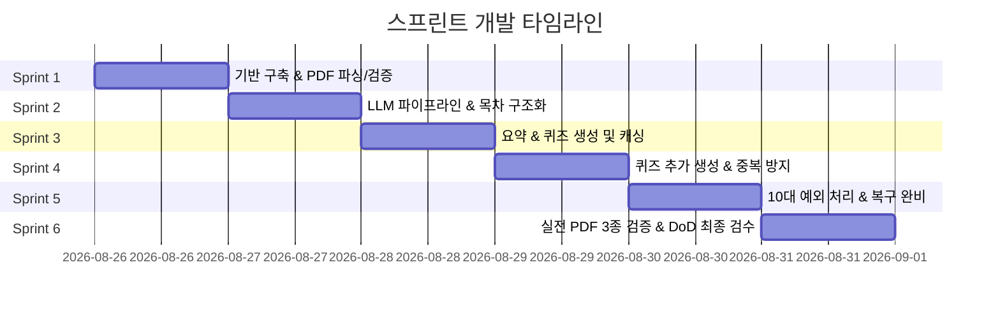

# PDF 강의자료 목차·요약·퀴즈 뷰어 개발 계획서 (Development Plan)

> **문서 버전:** 1.0.0  
> **기준 문서:** `PRD.md` (v1.0)  
> **작성일:** 2026-08-26  
> **상태:** 확정 (Ready for Sprint Execution)  

---

## 1. 개요 및 개발 원칙

본 문서는 `PRD.md`에 명시된 요구사항, 화면 명세, 10가지 예외 처리, 완료 조건(DoD)을 100% 충족하기 위한 단계별 스프린트 개발 계획서입니다.

### 1.1 핵심 제약 조건 및 원칙
1. **단일 화면 뷰 상태 전환 (Single Page View States)**: URL 라우팅이 아닌 단일 페이지 내 뷰 상태(`A: 업로드` ↔ `B: 목차 목록` ↔ `C: 목차 상세`) 전환으로 동작합니다.
2. **세션 메모리 보관 (No DB/Auth/Payment)**: 모든 데이터는 브라우저 메모리에만 보관되며 새로고침 시 초기화됩니다. 로그인/결제/DB 관련 요소는 일체 포함하지 않습니다.
3. **엄격한 원문 기반 생성 (Grounding & Anti-Hallucination)**: 요약 및 퀴즈는 파싱된 해당 목차의 원문 텍스트 범위 내에서만 생성되어 왜곡과 환각을 원천 차단합니다.
4. **10대 예외 처리 완비**: PRD 제5장에 명시된 10가지 예외 상황에 대해 규정된 사용자 문구, 화면 상태 보존, 자동/수동 재시도 정책을 엄격히 구현합니다.
5. **스프린트 점진적 빌드 (Sprint-based Execution)**: 각 스프린트별 명확한 DoD와 검증 기준을 두고 독립적인 기능 검증이 가능하도록 설계합니다.

---

## 2. 시스템 아키텍처 및 기술 전략

### 2.1 기술 스택
- **프레임워크**: Next.js (App Router), React 19, TypeScript
- **스타일링**: Tailwind CSS v4, Lucide React (아이콘)
- **PDF 파싱**: `pdfjs-dist` (Client/Server 하이브리드 또는 경량 파서 파이프라인)
- **LLM 엔진**: Google Gemini / OpenAI 호환 API Route Handler (`/api/ai/outline`, `/api/ai/summary`, `/api/ai/quiz`, `/api/ai/quiz-more`)
- **스키마 검증**: Zod (구조화된 출력 JSON 파싱 및 5.7 이상 결과 사전 차단)

### 2.2 데이터 모델 (In-Memory Session Model)
```typescript
// 목차 및 본문 슬라이스
export interface OutlineItem {
  id: string;             // e.g. "outline-1"
  order: number;          // 1, 2, 3...
  title: string;          // 챕터/섹션 제목
  contentSlice: string;   // 해당 목차에 해당하는 PDF 원문 텍스트
}

// 요약 데이터 (캐시)
export interface SummaryData {
  bullets: string[];      // 5~10개 고밀도 핵심 요약 불릿
  createdAt: number;
}

// 퀴즈 문항 데이터
export interface QuizItem {
  id: string;
  question: string;       // 문제 질문
  options: string[];      // 4개 보기
  answer: number;         // 정답 인덱스 (0~3)
  explanation: string;    // 해설
}

// 목차별 상세 캐시
export interface TopicDetailCache {
  summary?: SummaryData;
  quizzes: QuizItem[];
  userAnswers: Record<string, number>; // quizId -> selectedOption
}

// 전역 앱 세션 상태
export interface AppSessionState {
  view: 'upload' | 'outline' | 'detail';
  file: { name: string; size: number; pageCount: number } | null;
  rawText: string;
  outlines: OutlineItem[];
  selectedOutlineId: string | null;
  cache: Record<string, TopicDetailCache>; // outlineId -> Cache
}
```

---

## 3. 스프린트별 상세 개발 계획 (Sprint Breakdown)



---

### 🏃 Sprint 1: 기반 아키텍처 및 PDF 파싱/유효성 검증

- **목표**: 텍스트 기반 PDF 파일 업로드 및 텍스트 레이어 추출 파이프라인 완성, 5.1~5.4 사전 검증 구현
- **담당 영역**: `app/page.tsx`, `lib/pdf/`, `components/upload-view.tsx`
- **주요 작업 (Tasks)**:
  1. **PDF 텍스트 추출 엔진 구현 (`lib/pdf/extractor.ts`)**:
     - `pdfjs-dist` 또는 파서를 활용하여 페이지별 텍스트 및 메타데이터 추출
     - 페이지 수 및 총 문자 수(Character count) 계산
  2. **업로드 검증 로직 구현 (`lib/pdf/validator.ts`)**:
     - `5.1`: 파일 미선택 / 0바이트 검사 (`업로드할 PDF 파일을 먼저 선택해주세요.`)
     - `5.2`: MIME 타입 및 헤더 시그니처(`%PDF-`), 손상 파일 파싱 예외 처리 (`PDF 파일만 업로드할 수 있어요...` / `PDF 파일을 열 수 없어요...`)
     - `5.3`: 파일 크기 상한(20MB) 및 대용량 페이지 수 초과 사전 차단 (`파일 용량이 너무 커서 처리할 수 없어요...`)
     - `5.4`: 스캔본/이미지 PDF 검사 (추출된 텍스트가 최소 임계값 미만일 때 차단: `이 PDF에서는 텍스트를 추출할 수 없어요...`)
  3. **뷰 상태 A (업로드 화면) UI 개선**:
     - 드래그 앤 드롭 및 파일 피커 인터랙션
     - 파일 정보(파일명, 포맷팅된 용량) 표시 및 삭제 버튼
     - 분석 진행 중 로딩 인디케이터 및 비활성화 처리
- **완료 기준 (DoD)**:
  - 정상 PDF, 손상된 PDF, 0바이트 파일, 이미지 스캔 PDF 각각을 업로드했을 때 정확한 에러 문구가 표시되고 차단되는지 검증 완료.

---

### 🏃 Sprint 2: LLM 파이프라인 및 목차 자동 구조화

- **목표**: 추출된 텍스트를 기반으로 LLM을 호출하여 목차(챕터/섹션)와 해당 본문 범위를 구조화하고 뷰 상태 B로 자동 전환
- **담당 영역**: `app/api/ai/outline/route.ts`, `lib/ai/`, `components/outline-view.tsx`
- **주요 작업 (Tasks)**:
  1. **목차 구조화 프롬프트 & API 라우트 (`/api/ai/outline`)**:
     - PDF 전체 텍스트를 분석하여 챕터/섹션 제목과 각 섹션의 시작-끝 원문 텍스트 범위를 JSON으로 추출
     - Zod 스키마로 응답 무결성 검증 (목차 배열, 제목, contentSlice)
  2. **목차 이상 처리 및 복구 (5.5, 5.6, 5.7)**:
     - 목차가 0개이거나 비정상적으로 쪼개진 경우 감지 (`이 강의자료의 목차를 인식하지 못했어요...`)
     - 내부 1회 자동 재시도 후 실패 시 오류 표시 및 수동 재시도 버튼 노출
     - 타임아웃(5.6) 설정 및 일정 시간 경과 시 안내 문구 전환
  3. **뷰 상태 B (목차 목록 화면) 구현**:
     - 분석 완료 후 자동으로 뷰 상태 B로 부드러운 전환
     - 목차 카드 세로 목록 렌더링 (번호 및 제목)
     - 상단 "새 PDF 업로드" 버튼 (클릭 시 뷰 상태 A로 복귀)
     - 카드 클릭 시 선택된 목차 ID를 세션에 저장하고 뷰 상태 C로 전환
- **완료 기준 (DoD)**:
  - 20~40페이지 강의자료 업로드 시 1분 이내에 목차 목록이 생성되고, 각 목차별 원문 텍스트 슬라이스가 메모리에 격리 보관되는지 확인.

---

### 🏃 Sprint 3: 목차별 요약 & 퀴즈 온디맨드 생성 및 인메모리 캐싱

- **목표**: 선택한 목차의 원문 슬라이스를 바탕으로 온디맨드 요약(불릿 5~10개) 및 객관식 퀴즈(2~3문항) 생성 및 즉시 피드백 구현
- **담당 영역**: `app/api/ai/summary/route.ts`, `app/api/ai/quiz/route.ts`, `components/detail-view.tsx`
- **주요 작업 (Tasks)**:
  1. **온디맨드 요약 생성 API (`/api/ai/summary`)**:
     - 해당 목차의 `contentSlice`만 주입하여 원문 외 내용 포함을 엄격히 금지하는 프롬프트 적용
     - 고밀도 핵심 요약 불릿 5~10개 반환 (한 줄 요약 금지)
     - Zod 유효성 검사 (불릿 개수 부족 시 5.7 에러 핸들링)
  2. **온디맨드 퀴즈 생성 API (`/api/ai/quiz`)**:
     - 원문 및 요약 내용 기반 객관식 4지선다 2~3문항 생성
     - 정답 인덱스 및 명확한 해설(explanation) 포함
  3. **세션 메모리 캐싱 계층 구현**:
     - 이미 조회/생성된 목차의 요약 및 퀴즈는 세션 내 재사용 (불필요한 중복 API 호출 방지)
     - 다른 목차로 이동했다가 돌아와도 캐시된 데이터 즉시 렌더링
  4. **뷰 상태 C (목차 상세 화면) 인터랙션**:
     - "요약 보기" / "퀴즈 풀기" 상단 토글
     - 퀴즈 보기 선택 시 즉각적인 정답/오답 UI 표시 및 해설 박스 노출
     - 상단/하단 "목록으로 돌아가기" 버튼으로 뷰 상태 B 즉시 복귀
- **완료 기준 (DoD)**:
  - 요약 불릿이 5~10개로 충실하게 나오고, 퀴즈 풀이 시 정답 확인이 즉각 이루어지며, 탭 전환 및 목차 이동 시 캐싱이 정상 작동하는지 확인.

---

### 🏃 Sprint 4: 퀴즈 추가 생성 ("문제 더 풀기") 및 중복 방지 시스템

- **목표**: 퀴즈 완료 시 추가 문항 생성 기능 구현 및 5.8 중복 감지/필터링/재요청 파이프라인 구축
- **담당 영역**: `app/api/ai/quiz-more/route.ts`, `lib/ai/dedup.ts`, `components/quiz-view.tsx`
- **주요 작업 (Tasks)**:
  1. **퀴즈 완료 감지 및 "문제 더 풀기" 트리거**:
     - 현재 목차의 모든 퀴즈 문항에 답안을 선택하면 하단에 "문제 더 풀기" 버튼 표시
  2. **중복 방지 추가 생성 API (`/api/ai/quiz-more`)**:
     - 기존 출제된 문항 목록(질문 텍스트 배열)을 프롬프트에 동봉하여 중복 생성 억제
     - 응답 수신 후 기존 문항과 유사도/동일성 검사 (`lib/ai/dedup.ts`)
  3. **중복 감지 시 복구 정책 (5.8)**:
     - 중복 감지 시 백그라운드 1회 자동 재요청
     - 재요청 후에도 중복 발생 시 중복 문항만 제외하고 신규 문항만 머지
     - 유효 신규 문항이 0개일 경우 "새로운 문제를 만들지 못했어요. 잠시 후 다시 시도해주세요." 안내
  4. **상태 보존 머지**:
     - 기존 문항의 풀이 상태(사용자 선택값, 정답/오답 표시)를 온전히 유지한 채 새 문항을 하단에 append
- **완료 기준 (DoD)**:
  - "문제 더 풀기" 클릭 시 기존 풀이 상태가 유지되며 새 문항 2~3개가 추가되고, 기존 문제와 중복되지 않는지 검증.

---

### 🏃 Sprint 5: 10대 예외 처리 완비 및 복구 메커니즘 구축

- **목표**: PRD 제5장에 규정된 10가지 예외 상황의 감지, 문구, 상태 보존, 재시도 매커니즘을 전수 구현 및 방어벽 구축
- **담당 영역**: `lib/error/`, `components/error-boundary.tsx`, `components/error-box.tsx`
- **주요 작업 (Tasks)**:
  1. **10대 예외 처리 매트릭스 전수 구현**:
     | 번호 | 예외 상황 | 감지 방법 | 규정 문구 | 동작 및 재시도 |
     |---|---|---|---|---|
     | **5.1** | 파일 미선택 / 0바이트 | 업로드 시 파일 유무 및 size 검사 | "업로드할 PDF 파일을 먼저 선택해주세요." | 뷰 상태 A 머무름, 버튼 비활성화 |
     | **5.2** | 비PDF / 손상 파일 | MIME, 매직넘버, 파서 에러 catch | "PDF 파일만 업로드할 수 있어요..." / "PDF 파일을 열 수 없어요..." | 뷰 상태 A 에러 표시, 재업로드 유도 |
     | **5.3** | 용량 초과 / 대용량 | 20MB 이상 / 과다 페이지 사전 차단 | "파일 용량이 너무 커서 처리할 수 없어요..." | 뷰 상태 A 차단, 새 파일 선택 유도 |
     | **5.4** | 스캔본/텍스트 없음 | 문자수 < 최소 임계값 | "이 PDF에서는 텍스트를 추출할 수 없어요..." | 뷰 상태 A 에러 표시, OCR 미시도 |
     | **5.5** | AI 응답 실패 | API 5xx, 네트워크 에러 | 단계별 문구 ("목차를 분석하는 중..." / "요약을 생성하지..." / "퀴즈를 만들지...") | 이전 상태 유지, 1회 자동 재시도 후 수동 버튼 |
     | **5.6** | AI 타임아웃 | AbortController 타임아웃 초과 | 경과 중: "분석에 시간이 걸리고..." → 초과: "응답이 너무 오래 걸려..." | 로딩 해제, 수동 재시도 버튼 |
     | **5.7** | 응답 형식/구조 이상 | Zod 스키마 검증 실패 / 목차 0개 | "결과를 정리하는 중..." / "이 강의자료의 목차를 인식하지..." | 1회 자동 재시도 후 실패 시 수동 재시도 |
     | **5.8** | 신규 문항 중복 | 텍스트 유사도 검사 | "새로운 문제를 만들지 못했어요. 잠시 후 다시 시도해주세요." | 백그라운드 1회 재요청, 비중복만 머지 |
     | **5.9** | 네트워크 단절 | fetch catch (`navigator.onLine` / TypeError) | "네트워크 연결을 확인해주세요. 연결이 끊어져 요청을 완료하지 못했어요." | 현재 화면 상태 100% 보존, 재시도 버튼 노출 |
     | **5.10** | 세션 새로고침/이탈 | 브라우저 이벤트 | 별도 에러 문구 없음 (정상 동작) | 뷰 상태 A로 완전 초기화 (의도된 동작) |
  2. **재시도 컨트롤러 (`lib/api/retry-client.ts`)**:
     - 자동 1회 재시도 제한 (무한 루프 방지)
     - 수동 "다시 시도" 버튼 클릭 시 기존 상태 보존한 채 타깃 요청만 재수행
- **완료 기준 (DoD)**:
  - 10가지 예외 상황 각각을 유발했을 때 정확한 문구가 노출되고 정의된 화면 상태/복구 동작이 수행되는지 테스트 통과.

---

### 🏃 Sprint 6: 실전 검증 (PDF 3종), DoD 최종 검수 및 UI 폴리싱

- **목표**: 실제 강의자료 PDF 3종 실전 테스트, DoD 8대 조건 전수 검증, UX/성능 최적화
- **담당 영역**: 프로젝트 전체 (`app/`, `tests/`, `public/`)
- **주요 작업 (Tasks)**:
  1. **실제 강의자료 PDF 3종 실전 테스트**:
     - 시험 대비 요약본, 대학 전공 강의 슬라이드, 사내 교육 자료 등 3종 테스트
     - 원문 목차와 자동 인식 목차의 일치도 검수
     - 요약문의 원문 충실도(왜곡/환각 여부) 및 불릿 밀도(5~10개) 육안 검수
     - 퀴즈 난이도가 요약 범위 내에서 풀리는지 정답 검수
  2. **PRD 제6장 완료 조건(DoD) 전수 검사**:
     - [ ] 1. 텍스트 PDF 업로드 시 1분 이내 목차 목록 화면 전환
     - [ ] 2. 목차 카드 클릭 ↔ 상세 화면 ↔ 목록 복귀 부드러운 전환
     - [ ] 3. 요약(5~10개) 및 퀴즈(2~3문항) 정상 출력
     - [ ] 4. 퀴즈 완풀 후 "문제 더 풀기" 클릭 시 비중복 신규 문항 추가
     - [ ] 5. 10가지 예외 상황별 정확한 문구 및 화면 동작 일치
     - [ ] 6. 로그인/회원가입/결제/DB 일체 미포함 확인
     - [ ] 7. 실제 PDF 3종 기준 성공조건 충족
     - [ ] 8. 새로고침 시 세션 초기화 정상 작동
  3. **디자인 및 사용성 폴리싱**:
     - 다크모드/라이트모드 시각적 완성도 및 부드러운 트랜지션
     - 접근성(ARIA, 키보드 네비게이션, 포커스 링) 확인
- **완료 기준 (DoD)**:
  - DoD 8개 항목 모두 통과 및 실전 PDF 3종에 대해 끊김 없는 엔드투엔드 데모 완료.

---

## 4. PRD 요구사항 추적 매트릭스 (Traceability Matrix)

| PRD 항목 | 내용 | 담당 스프린트 | 구현 산출물 / 모듈 |
|---|---|---|---|
| **1) 목표/성공조건** | 5시간 내 완성, 1분 내 파싱, 요약 밀도, 퀴즈 품질 | Sprint 1~6 | 전체 시스템 및 AI 프롬프트 파이프라인 |
| **2) 사용자 스토리** | 목차 훑어보기, 불릿 요약, 퀴즈 및 추가 문제 | Sprint 2, 3, 4 | `UploadView`, `OutlineView`, `DetailView` |
| **3) 화면 명세** | 단일 페이지 뷰 상태 A/B/C 전환, 공통 헤더 | Sprint 1, 2, 3 | `app/page.tsx`, 뷰 컴포넌트 3종 |
| **4.1** | PDF 업로드 및 텍스트 추출 | Sprint 1 | `lib/pdf/extractor.ts`, `lib/pdf/validator.ts` |
| **4.2** | 목차 자동 구조화 및 본문 슬라이싱 | Sprint 2 | `/api/ai/outline/route.ts` |
| **4.3** | 원문 기반 요약 생성 (5~10개) | Sprint 3 | `/api/ai/summary/route.ts` |
| **4.4** | 퀴즈 생성 (4지선다 2~3문항, 즉시 정답) | Sprint 3 | `/api/ai/quiz/route.ts` |
| **4.5** | 문제 더 풀기 및 중복 억제 | Sprint 4 | `/api/ai/quiz-more/route.ts`, `lib/ai/dedup.ts` |
| **4.6** | 화면 전환 및 세션 메모리 캐싱 | Sprint 3, 4 | 전역 상태 훅 & 인메모리 캐시 매니저 |
| **5.1 ~ 5.10** | 10대 예외 처리 및 지정 문구/재시도 | Sprint 1, 5 | `lib/error/`, `components/error-box.tsx` |
| **6) 완료 조건** | Definition of Done 8개 항목 | Sprint 6 | `docs/TEST_REPORT.md`, 최종 검증 게이트 |

---

## 5. 문서 관리 및 향후 운영 계획

1. **문서 저장소 (`/docs`)**:
   - `docs/DEVELOPMENT_PLAN.md` (본 문서): 전체 개발 계획 및 스프린트 정의
   - `docs/SPRINT_LOG.md`: 스프린트별 진행 상황 및 이슈 트래킹
   - `docs/TEST_REPORT.md`: 10대 예외 케이스 및 실제 PDF 3종 검증 결과 보고서
2. **진행 방식**:
   - 각 스프린트 시작 전 Tasks 리뷰 → 구현 → 스프린트 DoD 검증 후 다음 스프린트 착수
