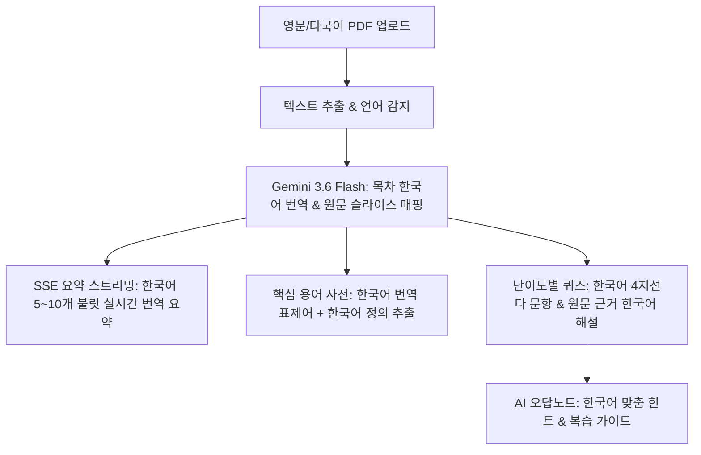

# [개발 개선 계획서] 영문 PDF 문서 업로드 시 한국어 자동 로컬라이제이션 (Korean Localization)

> **기준 문서:** `PRD.md`, `desgin.md`, `docs/DEVELOPMENT_PLAN.md`  
> **목표:** 해외 대학 강의자료, 영문 전공 교재, 논문 PDF 등 **영어로 작성된 문서가 업로드되더라도 목차, 실시간 스트리밍 요약, 퀴즈, 오답 힌트, 용어 사전을 100% 자연스럽고 전문적인 한국어로 자동 변환 및 제공**하는 인텔리전트 다국어 로컬라이제이션 파이프라인 구축  
> **작성일:** 2026-08-27  

---

## 1. 개요 및 요구사항 정의

### 1.1 현황 및 문제점
- 현재 서비스는 국문 PDF 자료에서는 완벽하게 한국어로 동작하나, 영문 슬라이드(MIT, Stanford, 영문 CS 전공자료 등) 업로드 시 원문 언어(영어)가 그대로 목차 및 요약에 반영될 수 있음.
- 사용자는 영문 전공 자료를 보더라도 **한국어로 명확하고 구조화된 목차 및 요약·퀴즈**를 통해 빠르게 이해하기를 원함.

### 1.2 핵심 개선 원칙
1. **언어 투명성 (Language Transparency)**: 원문이 영어, 국문, 또는 혼합 문서이더라도 최종 학습 인터페이스(목차 제목, 불릿 요약, 퀴즈 질문/선지/해설, 핵심 용어집 정의)는 **자연스럽고 전문적인 학술 한국어(Korean)**로 통일.
2. **학술 용어 영문 병기 원칙 (Academic Term Bilingual Notation)**: 전공 핵심 용어는 `한국어 번역어 (영문 원어)` 형태로 병기하여 학술적 엄밀성과 학습 직관성을 동시 보장 (예: `문맥 교환 (Context Switch)`, `상호 배제 (Mutual Exclusion)`).
3. **원문 근거 기반 번역 요약 (Grounded Translation)**: Gemini 3.6 Flash 모델의 고성능 번역 및 압축 요약 역량을 결합하여 왜곡과 환각 없이 원문 팩트에 100% 기반한 한국어 요약 생성.

---

## 2. 모듈별 개선 상세 계획

### 2.1 [API] 목차 구조화 (`lib/ai/outline-service.ts`, `app/api/ai/outline/route.ts`)
- **개선 프롬프트**:
  - `[다국어 처리 지침] 원문이 영어(English) 또는 다국어인 경우, 목차 제목(title)을 학습자가 직관적으로 이해할 수 있는 전문적인 한국어로 번역/정리하여 생성하세요. (예: "1. Introduction to Operating Systems" ➔ "1. 운영체제 개요 및 핵심 아키텍처")`
- **Fallback 규칙 엔진**:
  - 영문 헤딩(`Chapter 1. ...`, `Section 2. ...`) 감지 시 번역 매핑 및 한국어 기본 챕터 타이틀 정돈.

### 2.2 [API] 요약 및 실시간 SSE 스트리밍 (`lib/ai/summary-service.ts`, `app/api/ai/summary-stream/route.ts`)
- **개선 프롬프트**:
  - 원문 슬라이스가 영어이더라도 실시간 SSE 스트리밍 및 배치 요약 생성 시 **반드시 완성도 높은 한국어 불릿(5~10개)**으로 작성.
  - 전공 용어는 한국어 표준 번역어와 영문 병기 적용.

### 2.3 [API] 난이도별 퀴즈 & 추가 문제 (`lib/ai/quiz-service.ts`, `app/api/ai/quiz/route.ts`, `quiz-more/route.ts`)
- **개선 프롬프트**:
  - 퀴즈 질문(`question`), 4개 선택지(`options`), 정답 해설(`explanation`)을 모두 명확한 한국어로 작성.
  - 원문의 영문 개념을 정확한 한국어 시험 문제 형태로 변환.

### 2.4 [API] 핵심 전공 용어집 (`app/api/ai/glossary/route.ts`)
- **개선 프롬프트**:
  - `term`: `한국어 용어명 (영문 원어)` (예: `프로세스 제어 블록 (PCB)`)
  - `definition`: 알기 쉽고 정확한 한국어 정의 1~2문장
  - `category`: 한국어 분류 태그 (예: `자료구조`, `알고리즘`, `시스템`)

### 2.5 [API] 오답 맞춤형 힌트 (`app/api/ai/quiz-hint/route.ts`)
- **개선 프롬프트**:
  - 오답 분석(`whyWrong`), 복습 가이드(`reviewGuide`), 핵심 포인트(`keyPoint`)를 100% 한국어로 1:1 튜터링 제공.

---

## 3. 실전 영문 샘플 테스트 및 검증 계획

### 3.1 영문 실전 테스트셋 구축
- **영문 샘플 데이터**: `MIT 6.004 Computation Structures / Stanford CS140 Operating Systems` 기반 100% 영문 PDF 텍스트 구성
- **검증 항목**:
  1. `POST /api/ai/outline` ➔ 영문 원문 입력 시 3~5개 목차가 모두 완벽한 한국어로 출력되는지 검증
  2. `GET /api/ai/summary-stream` ➔ 실시간 SSE 스트림으로 수신되는 불릿이 모두 한국어인지 검증
  3. `POST /api/ai/quiz` ➔ 기초/심화 퀴즈 문항과 선지, 해설이 모두 한국어로 생성되는지 검증
  4. `POST /api/ai/glossary` ➔ 영문 용어가 한영 병기 및 한국어 정의로 추출되는지 검증
  5. `POST /api/ai/quiz-hint` ➔ 오답 선택 시 한국어 복습 가이드가 정상 반환되는지 검증

---

## 4. 작업 단계 (Execution Steps)

1. **Step 1:** AI 서비스 레이어 프롬프트 고도화 (`outline-service.ts`, `summary-service.ts`, `quiz-service.ts`, `glossary/route.ts`, `quiz-hint/route.ts`, `summary-stream/route.ts`)
2. **Step 2:** 영문 테스트셋 작성 및 E2E 검증 스크립트 실행 (`scratch/test_english_pdf_localization.mjs`)
3. **Step 3:** `npm run build` 빌드 검증 및 Vercel 실시간 배포
4. **Step 4:** 문서 갱신 및 터미널 출력 보고
