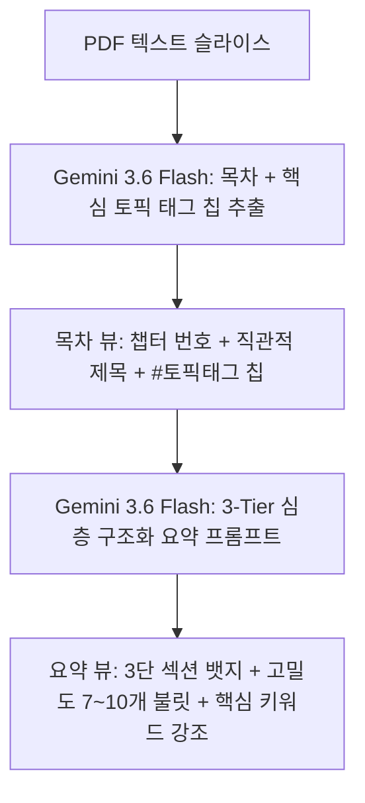

# [개발 개선 계획서] 목차 가독성 극대화 및 고밀도 3단 구조화 요약 시스템

> **기준 문서:** `PRD.md` (v1.0), `desgin.md` (Scholarly Ambient), `docs/DEVELOPMENT_PLAN.md`  
> **목표:** 단조롭고 알아보기 힘든 목차를 **직관적인 계층형 카드(챕터 번호 + 명확한 제목 + 핵심 토픽 태그 칩)**로 개편하고, 부실한 요약을 **3단 구조화(핵심 정의 ➔ 작동 원리/메커니즘 ➔ 트레이드오프/비교 분석) 고밀도 심층 요약**으로 전면 고도화  
> **작성일:** 2026-08-27  

---

## 1. 문제점 및 개선 목표

| 영역 | 현 문제점 | 개선 목표 |
|---|---|---|
| **목차 (Outline)** | • 긴 문장 나열로 한눈에 파악 불가<br>• 각 단원이 무엇을 다루는지 미리보기 부족<br>• 시각적 위계(Hierarchy) 부족 | • **챕터 번호 + 명확하고 간결한 핵심 제목**<br>• **핵심 토픽 태그 칩(예: `#프로세스`, `#PCB`, `#스케줄링`) 자동 추출 및 노출**<br>• 단정한 학술 카드 레이아웃과 예상 학습량 안내 |
| **요약 (Summary)** | • 3~5줄의 추상적이고 짧은 문장 위주<br>• 구체적인 원리/단계/비교 분석 결여<br>• PRD 4.3의 "제3자 설명 수준 고밀도 요약" 미달 | • **3단 심층 구조화 요약 (3-Tier Structured Summary)** 도입<br>  1) 💡 핵심 개념 & 표준 정의 (2~3불릿)<br>  2) ⚙️ 동작 메커니즘 & 단계별 절차 (3~4불릿)<br>  3) ⚖️ 핵심 비교 & 트레이드오프/주의사항 (2~3불릿)<br>• **총 7~10개의 고밀도 전문 불릿 작성 강제** |

---

## 2. 세부 개발 계획



### 2.1 목차 구조화 개선 (`lib/types.ts`, `lib/ai/outline-service.ts`, `components/outline-view.tsx`)
1. **데이터 모델 확장 (`OutlineItem`)**:
   ```typescript
   export interface OutlineItem {
     id: string;
     order: number;
     title: string;              // 명확하고 정제된 챕터 제목
     topicTags?: string[];       // 핵심 키워드 2~3개 (예: ["프로세스", "PCB", "문맥교환"])
     estimatedMinutes?: number;  // 예상 학습 소요 시간 (예: 5분)
     contentSlice: string;
   }
   ```
2. **AI 프롬프트 고도화**:
   - 불필요하게 긴 수식어를 배제하고, `[대주제/챕터 번호]: [명확한 핵심 명사형 제목]` 형식으로 정제.
   - 각 챕터 본문에서 가장 핵심이 되는 태그 2~4개(`topicTags`)를 동시 추출하도록 JSON 스키마 확장.
3. **UI 리디자인 (`components/outline-view.tsx`)**:
   - 챕터 번호 인디고 인덱스 뱃지
   - 명확한 볼드 타이틀 + 하단 토픽 태그 칩 렌더링
   - 호버 시 부드러운 인디고 틴트 및 우측 화살표 트랜지션

---

### 2.2 요약 엔진 3단 구조화 고도화 (`lib/ai/summary-service.ts`, `app/api/ai/summary-stream/route.ts`, `components/detail-view.tsx`)
1. **3-Tier 심층 요약 프롬프트 설계**:
   - **Tier 1: 💡 [핵심 정의 및 개념 체계]**: 원문이 규정하는 핵심 용어의 정의, 목적, 3대/4대 기본 요소를 명확히 서술 (2~3개 불릿).
   - **Tier 2: ⚙️ [동작 원리 및 핵심 메커니즘]**: 데이터 흐름, 시스템 동작 순서(1단계➔2단계➔3단계), 세부 기술 원리를 팩트 기반으로 구체적 서술 (3~4개 불릿).
   - **Tier 3: ⚖️ [장단점, 비교 분석 및 주의사항]**: 타 기술과의 차이점, 성능 트레이드오프, 적용 시 제약조건을 제3자에게 설명할 수 있는 수준으로 서술 (2~3개 불릿).
2. **출력 품질 제약조건**:
   - 추상적 서술("효율적인 처리를 지원합니다") 전면 금지 ➔ 구체적 메커니즘("TLB 하드웨어 캐시를 통해 가상 주소 변환 지연을 O(1) 수준으로 단축합니다") 강제.
   - 총 7~10개의 풍부하고 깊이 있는 불릿 생성.
3. **UI 렌더링 개선 (`components/detail-view.tsx`)**:
   - 불릿 내 핵심 전문 용어에 부드러운 인디고 볼드 강조 적용.
   - 3단 카테고리 헤더 뱃지와 깔끔한 인덴트(여백) 적용으로 시각적 가독성 극대화.

---

## 3. 검증 및 배포 로드맵

1. **Step 1: 데이터 모델 및 AI 프롬프트 스키마 확장**
   - `lib/types.ts` `OutlineItem` 확장
   - `lib/ai/outline-service.ts`, `lib/ai/summary-service.ts`, `app/api/ai/summary-stream/route.ts` 프롬프트 수정
2. **Step 2: UI 컴포넌트 리디자인**
   - `components/outline-view.tsx` (태그 칩, 계층형 목차 카드)
   - `components/detail-view.tsx` (3단 구조화 요약 렌더러)
3. **Step 3: E2E 품질 검증 스크립트 실행**
   - `scratch/test_outline_and_summary_depth.mjs` 작성 및 실제 목차/요약 밀도 100% 검증
4. **Step 4: 빌드 무결성 확인 및 Vercel 실시간 배포**
