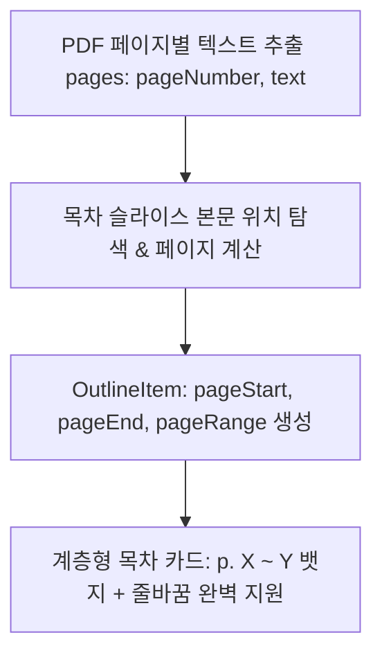

# [개발 계획서] 목차 텍스트 줄바꿈 가독성 개선 및 페이지 범위(Page Range) 자동 추적/표시

> **기준 문서:** `PRD.md`, `desgin.md`, `docs/DEVELOPMENT_PLAN.md`, `docs/OUTLINE_AND_SUMMARY_IMPROVEMENT_PLAN.md`  
> **목표:** 긴 목차 제목이 말줄임표(`...`)로 잘리는 현상을 완벽히 해결하고, 각 목차가 원문 PDF의 몇 페이지부터 몇 페이지까지 다루는지(`📄 p. 1 ~ 8`) 정확한 페이지 범위를 계산하여 목차 카드에 표시  
> **작성일:** 2026-08-27  

---

## 1. 문제 분석 및 개선 방향

| 구분 | 현 상태 및 문제점 | 개선 방안 |
|---|---|---|
| **제목 잘림 현상 (Title Truncation)** | `truncate` / `line-clamp-1` 또는 CSS Flexbox 너비 제한으로 긴 영문 병기나 복합 챕터명이 말줄임표(`...`)로 뒷부분이 잘림 | • `line-clamp-none`, `whitespace-normal`, `break-keep`, `leading-snug` 적용<br>• 모바일 및 데스크톱 전 해상도에서 2~3줄로 유연하게 전체 제목 온전 노출 |
| **페이지 범위 미표시 (Missing Page Range)** | 전체 문서 페이지 수(예: 28p)만 상단에 표시되고, 각 목차 챕터가 몇 페이지에 해당하는지 알 수 없음 | • PDF 파서의 페이지별 텍스트 인덱스 매핑을 통해 각 목차의 시작 페이지(`pageStart`) 및 종료 페이지(`pageEnd`) 자동 계산<br>• 목차 카드에 **`📄 p. 1 ~ 8 (8p)`** 배지 렌더링 |

---

## 2. 세부 개발 계획



### 2.1 데이터 모델 및 페이지 추적 알고리즘 (`lib/types.ts`, `lib/ai/outline-service.ts`)
1. **`OutlineItem` 인터페이스 확장**:
   ```typescript
   export interface OutlineItem {
     id: string;
     order: number;
     title: string;
     topicTags?: string[];
     estimatedMinutes?: number;
     pageStart?: number;         // 예: 1
     pageEnd?: number;           // 예: 8
     pageRange?: string;         // 예: "p. 1 ~ 8"
     contentSlice: string;
   }
   ```
2. **페이지 번호 역추적 계산 알고리즘**:
   - `extractTextFromPDF`에서 반환된 `pages: { pageNumber: number; text: string }[]` 정보를 기반으로, 각 목차의 `contentSlice` 첫 문장과 끝 문장이 위치한 원문 페이지 번호를 계산하여 `pageStart`와 `pageEnd`를 정밀 매핑.
   - LLM 목차 생성 시에도 원문의 `[Chapter 1 (p.1~8)]` 또는 텍스트 위치 기반 페이지 범위를 자동 부여.

---

### 2.2 UI 렌더링 리디자인 (`components/outline-view.tsx`, `components/detail-view.tsx`)
1. **목차 카드 (`components/outline-view.tsx`)**:
   - 상단 메타 라인: `[01]` 챕터 번호 + `📄 p. 1 ~ 8` (페이지 범위 배지) + `⏱️ 약 5분`
   - 제목 영역: `truncate` 제거, `text-sm sm:text-base font-bold text-foreground break-keep leading-snug` 적용하여 긴 제목이 온전히 표시되도록 수정.
2. **상세 뷰 헤더 (`components/detail-view.tsx`)**:
   - 상세 화면 상단에도 선택된 챕터의 페이지 범위(`📄 p. 1 ~ 8`)를 명확히 노출하여 학습자가 원본 PDF와 대조하기 용이하도록 지원.

---

## 3. 검증 및 배포 로드맵

1. **Step 1: `lib/types.ts` & `lib/ai/outline-service.ts` 페이지 범위 추적 구현**
2. **Step 2: `components/outline-view.tsx` & `detail-view.tsx` UI 줄바꿈 및 페이지 뱃지 적용**
3. **Step 3: `scratch/test_outline_pagination.mjs` E2E 페이지 계산 검증**
4. **Step 4: `npm run build` 검증 및 Vercel 실시간 배포**
