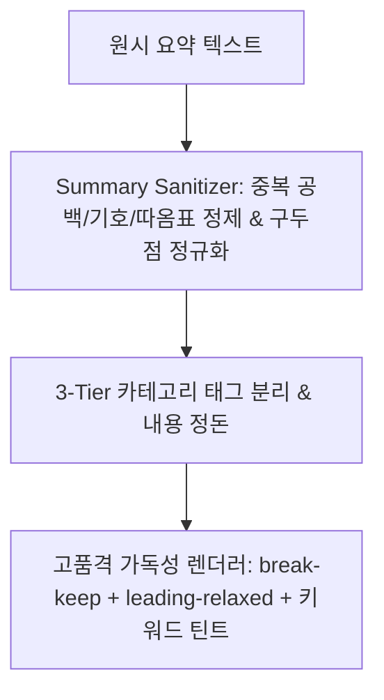

# [개발 계획서] 세부 요약 텍스트 정제(Sanitizer) 및 가독성/띄어쓰기 개선

> **기준 문서:** `PRD.md`, `desgin.md` (Scholarly Ambient), `docs/OUTLINE_AND_SUMMARY_IMPROVEMENT_PLAN.md`  
> **목표:** 요약 텍스트 내 띄어쓰기 오류, 불필요한 노이즈 기호(연속 공백, 잔여 마크다운, 중복 기호 등)를 원천 정제하고, 단어 단위 줄바꿈(`break-keep`)과 쾌적한 행간(`leading-relaxed`)을 적용하여 세부 요약의 읽기 가독성을 극대화  
> **작성일:** 2026-08-27  

---

## 1. 문제 분석 및 개선 방향

| 구분 | 현 상태 및 문제점 | 개선 방안 |
|---|---|---|
| **띄어쓰기 & 노이즈 기호** | • PDF 파싱 및 LLM 생성 과정에서 다중 공백(`  `), 불필요한 따옴표(`"`, `'`), 백틱(`` ` ``), 중복 불릿 기호(`- 1. -`) 유입<br>• 구두점(마침표, 쉼표, 괄호) 앞뒤 띄어쓰기 불일치 | • **전용 텍스트 정제 파이프라인 (`sanitizeSummaryText`) 구축**<br>  - 다중 공백 압축(`\s{2,}` ➔ ` `)<br>  - 잔여 마크다운/따옴표/중복 기호 자동 제거<br>  - 3단 태그(`💡 [핵심 정의]`, `⚙️ [동작 원리]`, `⚖️ [비교 및 주의점]`) 정밀 파싱 및 표준화 |
| **줄바꿈 및 시각적 가독성** | • 한글 단어가 글자 단위로 어색하게 쪼개져 줄바꿈되는 현상<br>• 텍스트 밀도가 높아 장시간 학습 시 시각적 피로 유발 | • **`break-keep` (단어 단위 줄바꿈) + `leading-[1.75]` (편안한 행간) 적용**<br>• 핵심 전공 용어(괄호 영문 표기 등)에 시각적 하이라이트 틴트 적용<br>• 카드 내부 패딩(`p-4 sm:p-5`) 및 요소 간 간격 최적화 |

---

## 2. 세부 개발 계획



### 2.1 텍스트 정제 유틸리티 (`lib/utils/text-cleaner.ts`)
```typescript
/**
 * 요약 불릿 텍스트 전처리 및 노이즈 제거 정규화 함수
 */
export function sanitizeSummaryBullet(rawText: string): {
  category: 'definition' | 'mechanism' | 'tradeoff' | 'general';
  categoryLabel: string;
  cleanText: string;
} {
  // 1. 불필요한 앞뒤 공백 및 마크다운/따옴표 제거
  // 2. 다중 공백 단일화 및 구두점 앞뒤 띄어쓰기 정돈
  // 3. 3-Tier 카테고리 태그(💡, ⚙️, ⚖️) 정밀 분리
  // 4. 단어 중간 깨짐 및 특수문자 정돈
}
```

### 2.2 AI 프롬프트 강화 (`lib/ai/summary-service.ts` & `app/api/ai/summary-stream/route.ts`)
- **프롬프트 품질 지침 강화**:
  - `[띄어쓰기 및 맞춤법 엄수]` 불필요한 공백, 따옴표, 백틱, 줄바꿈 노이즈를 절대 포함하지 말고 표준 한국어 맞춤법과 띄어쓰기를 철저히 준수하여 출력할 것.
  - 마침표(`.`) 뒤에는 반드시 한 칸의 공백만 둘 것.

### 2.3 UI 가독성 렌더러 리팩토링 (`components/detail-view.tsx`)
- **타이포그래피 클래스 적용**:
  - `break-keep` (단어 중간 잘림 방지)
  - `leading-[1.75]` 및 `tracking-normal` (시각적 피로도 최소화)
  - 카테고리 뱃지와 본문 텍스트 간의 완벽한 수직 정렬(`items-start gap-3.5`)
  - 괄호 안의 영문 학술 용어(예: `(Context Switch)`)에 은은한 폰트 대비 적용

---

## 3. 검증 및 배포 로드맵

1. **Step 1: `lib/utils/text-cleaner.ts` 텍스트 정제 엔진 구현**
2. **Step 2: AI 요약 프롬프트 띄어쓰기 지침 강화 및 API 라우트 연동**
3. **Step 3: `components/detail-view.tsx` 가독성 렌더러 리팩토링**
4. **Step 4: `scratch/test_summary_text_cleaning.mjs` 노이즈 제거 E2E 검증**
5. **Step 5: `npm run build` 빌드 검증 및 Vercel 실시간 배포**
